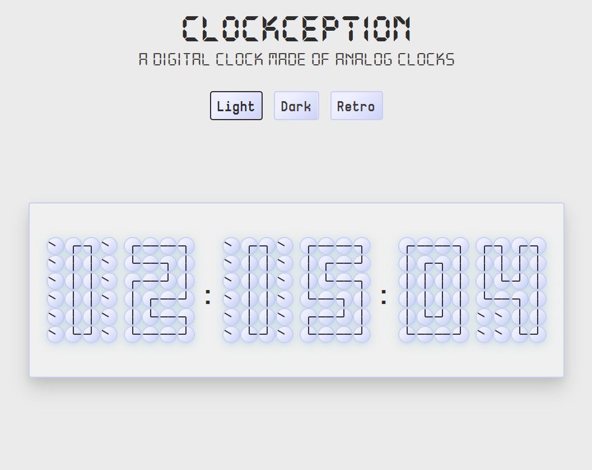
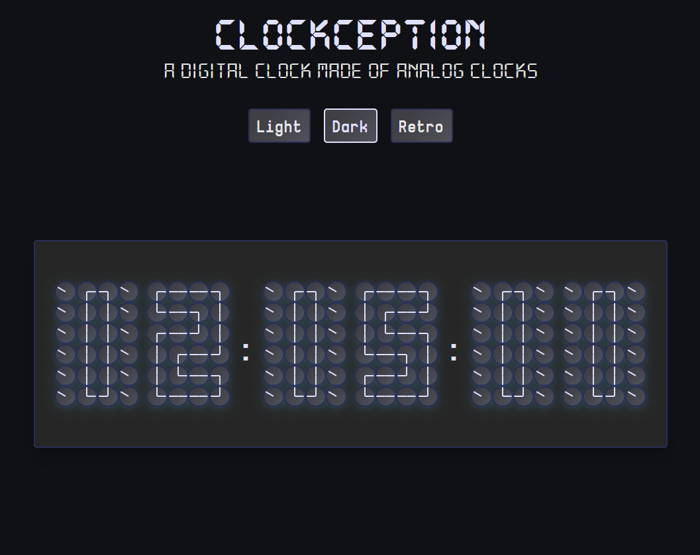
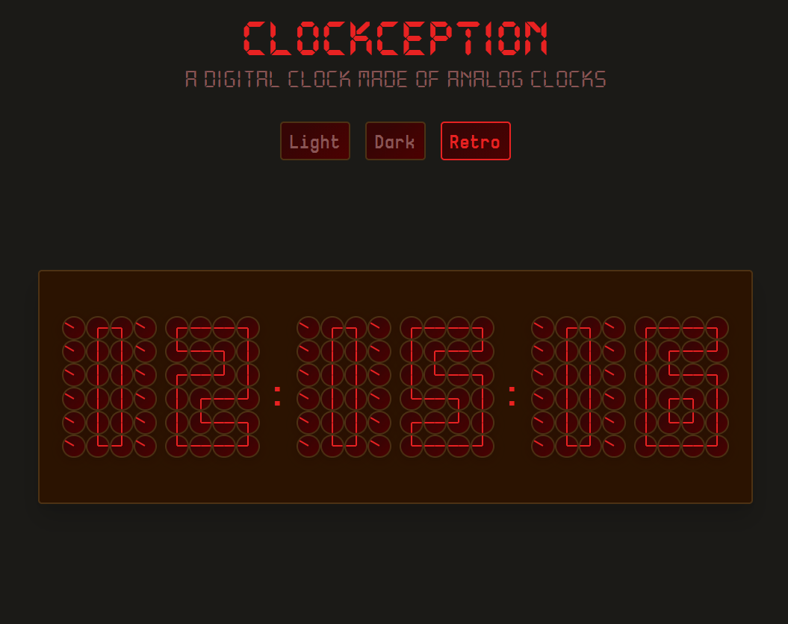

# Clockception: a digital clock made of analog clocks

**A clock that tells the current time ...using clocks... that tell a different time.**

Every second:
- The time updates
- Digits change shape
- 144 tiny clocks politely rotate their hands forward to comply (no clock ever runs backwards. They are professionals.)

Clockception includes three visual themes:

- **Light**: bright and minimal
- **Dark**: subdued, lower contrast
- **Retro**: stylized colors inspired by older digital clock displays

# Live version [here](https://clockception.pages.dev/)!

## Why Does This Exist?

The idea came after watching a video where teenagers in 2026 couldn't read an analog clock. The project leans into the absurdity of the situation: a digital clock that is only readable *because* it is constructed from analog clocks.

## Demo

  
  
  

 

## Running It Locally

First clone the repository to your local machine and navigate to the project directory. Install the project dependencies using:

#### `npm install`

You can run the app in development mode using:

#### `npm run dev`

Then open [http://127.0.0.1:5173/](http://127.0.0.1:5173/) to view it in your browser. The page will reload when you make changes. 

If for some reason you want to run this in production, you can run:
#### `npm run build`
 

## How It Works

- The current time is read once per second and split into `HH:MM:SS`
- Each digit maps to a predefined grid of clock hand positions
- Each position renders a small analog clock
- Clock hand angles are normalized so they only ever rotate forward
- Initial state uses Infinity to prevent partial renders before angles are computed
 

### License
MIT